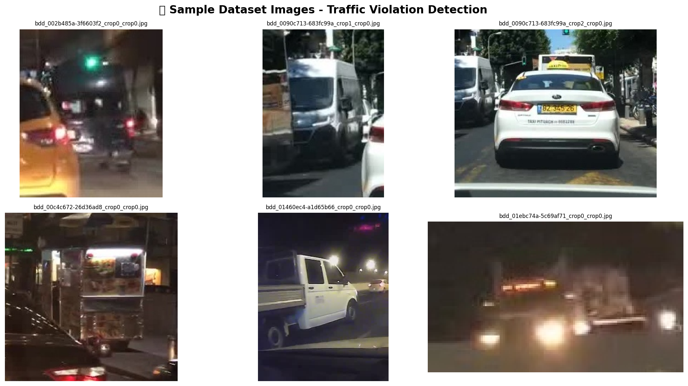
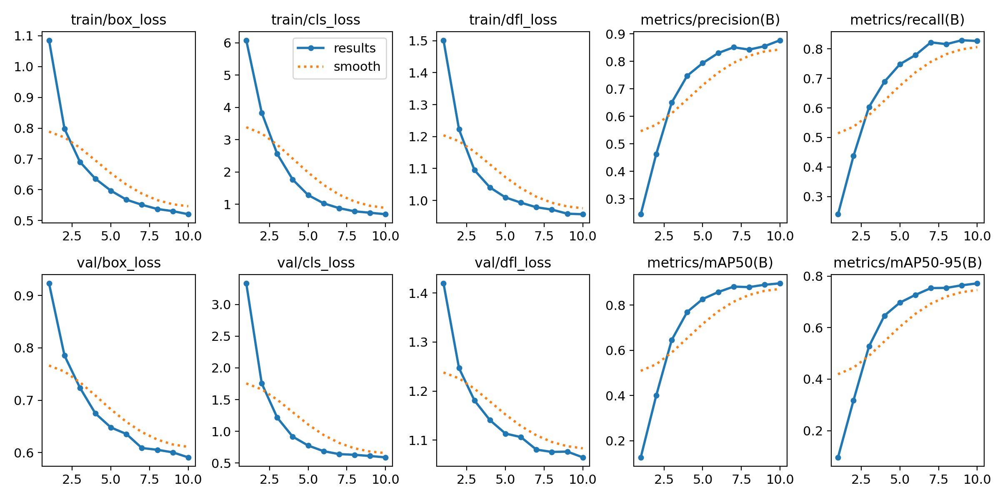

# 🎯 YOLOv8 Object Detection Lab

> **Lab Assignment** — Deep Learning & Computer Vision | 2025–26  
> **Institute:** MIT Academy of Engineering | **Department:** AIML  
> **Course Code:** MDM | **Semester:** VII | **Batch:** T3

---

## 👥 Group Details

| # | Member | PRN | GitHub |
|---|--------|-----|--------|
| 1 (Leader) | Mohit Patil | 202301070070 | @A7080mohitpatil |
| 2 | Gauri Narharshettiwar | 202301070050 | gauri0212 |
| 3 | Amir Furquani | 202301070052 | Isha-Nar |

**Faculty:** Dr. Diptee Ghusse (HOD AIML)  
**Lab Date:** 24/03/2026 | **Submission Date:** 25/03/2026

---

## 📋 About This Project

This project implements **object detection**, **instance segmentation**, and **image classification** using **YOLOv8** (Ultralytics). We evaluate multi-task performance across YOLOv8 variants and explore real-world applications of multi-task YOLO models.

---

## 🔧 Setup

```bash
pip install ultralytics==8.2.0 roboflow supervision matplotlib seaborn pandas numpy opencv-python-headless Pillow PyYAML
```

---

## 🚀 Run

Open `YOLOv8_Object_Detection_Lab_Template.ipynb` in Google Colab and run all cells sequentially.  
Ensure GPU runtime is enabled: `Runtime → Change runtime type → GPU`

---

## 🖼️ Sample Data



---

## 📊 Results

### Training Curves and Loss per Epoch


| Task | Model | Precision | Recall | mAP@50 | mAP@50-95 |
|------|-------|-----------|--------|--------|-----------|
| Detection | YOLOv8m | 0.8766 | 0.8267 | 0.8959 | 0.7721 |

---

## 🌍 Application

The traffic detection system developed using YOLOv8 can be applied in real-time traffic monitoring to analyze vehicle flow and congestion, as well as in detecting traffic violations such as signal jumping and lane misuse. It can support smart traffic signal control by dynamically adjusting timings based on traffic density, improving overall road efficiency. Additionally, it is useful for surveillance and safety systems to identify accidents or abnormal activities, and can also assist autonomous driving systems by detecting vehicles and road elements, making it a valuable component in intelligent transportation systems.

---

## 📁 File Structure

```
.
├── YOLOv8_Object_Detection_Lab_Template.ipynb   # Main notebook
├── README.md
├── requirements.txt
└── results/
    ├── detection_output.png
    ├── segmentation_output.png
    ├── classification_top5.png
    ├── seg_comparison.png
    ├── benchmark_comparison.png
    └── training_curves.png
```

---

## 📜 Undertaking

All code is original group work. Submitted as per academic undertaking signed by all group members.
